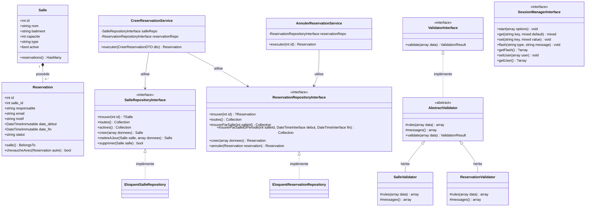

# Analyse des Choix Architecturaux — Gestion des Réservations de Salles

Ce document présente l'analyse architecturale détaillée de l'application conformément aux spécifications du projet.

---

## Sommaire
1. [Architecture Globale & Diagramme de Classes](#1-architecture-globale--diagramme-de-classes)
2. [Analyse des Notions Architecturales](#2-analyse-des-notions-architecturales)
   - [MVC (Modèle-Vue-Contrôleur)](#mvc-modèle-vue-contrôleur)
   - [Front Controller](#front-controller)
   - [Router](#router)
   - [Validator (Validation)](#validator-validation)
   - [DTO (Data Transfer Object)](#dto-data-transfer-object)
   - [ORM (Object-Relational Mapping)](#orm-object-relational-mapping)
   - [Active Record](#active-record)
   - [Repository](#repository)
   - [Service (Couche Métier)](#service-couche-métier)
   - [Injection par constructeur](#injection-par-constructeur)
   - [Conteneur d'injection de dépendances](#conteneur-dinjection-de-dépendances)
   - [Autowiring](#autowiring)
   - [Inversion de Contrôle (IoC)](#inversion-de-contrôle-ioc)
   - [Les cinq principes SOLID](#les-cinq-principes-solid)

---

## 1. Architecture Globale & Diagramme de Classes



---

## 2. Analyse des Notions Architecturales

### MVC (Modèle-Vue-Contrôleur)
1. **Classes concernées :** `App\Model\Salle`, `App\Model\Reservation`, `App\Controller\SalleController`, `App\Controller\ReservationController`, `templates/salle/*`, `templates/reservation/*`.
2. **Rôle :** Séparer la présentation (Vue), la gestion des flux/requêtes HTTP (Contrôleur) et la persistance/structure des données (Modèle).
3. **Avantage :** Lisibilité et maintenabilité accrues, responsabilités clairement réparties.
4. **Limite / Risque :** Risque de "Fat Controller" ou "Fat Model" si les règles métier ne sont pas déportées dans des services dédiés.
5. **Extrait représentatif :**
```php
// SalleController.php
public function index(): void
{
    $salles = $this->salleRepository->toutes();
    respond('salle/index.php', ['salles' => $salles]);
}
```

---

### Front Controller
1. **Classes concernées :** `public/index.php`, `App\Application`.
2. **Rôle :** Point d'entrée unique de l'application web interceptant toutes les requêtes entrantes pour centraliser l'initialisation (autoload, .env, conteneur, session, routage).
3. **Avantage :** Centralise la sécurité (CSRF, authentification), le démarrage des sessions et la gestion uniforme des erreurs HTTP (404, 405, 500).
4. **Limite / Risque :** Peut devenir un goulot d'étranglement ou un fichier surchargé s'il orchestre trop de logique bas niveau.
5. **Extrait représentatif :**
```php
// public/index.php
$container = $containerBuilder->build();
$application = $container->has(Application::class)
    ? $container->get(Application::class)
    : new Application($container);
$application->run();
```

---

### Router
1. **Classes concernées :** `App\Router\RouterInterface`, `App\Router\Router`, `FastRoute\RouteCollector`, `routes/web.php`.
2. **Rôle :** Associer des motifs d'URL et des méthodes HTTP (GET, POST) à des actions de contrôleurs. Le Router prend en charge la résolution des routes, l'instanciation directe des contrôleurs (avec injection de leurs dépendances de services) et l'exécution de l'action correspondante.
3. **Avantage :** Découplage complet : le conteneur d'injection de dépendances ne gère que les services et l'infrastructure technique, tandis que le Router gère le cycle de vie des contrôleurs HTTP.
4. **Limite / Risque :** Nécessite une configuration minutieuse des regex et des méthodes autorisées (gestion explicite de 405 Method Not Allowed).
5. **Extrait représentatif :**
```php
// routes/web.php
$r->addRoute('GET', '/salles/{id:\d+}', [SalleController::class, 'show']);
$r->addRoute('POST', '/reservations/{id:\d+}/cancel', [ReservationController::class, 'cancel']);

// App\Router\Router.php
$controller = $this->instantiateController($controllerClass);
$controller->$method(...$arguments);
```

---

### Validator (Validation)
1. **Classes concernées :** `App\Validation\ValidatorInterface`, `App\Validation\AbstractValidator`, `App\Validation\SalleValidator`, `App\Validation\ReservationValidator`, `App\Validation\ValidationResult`.
2. **Rôle :** Valider la syntaxe et la conformité des données reçues en entrée (POST/GET) avant toute utilisation ou persistance, sans logique conditionnelle `if/else` dispersée.
3. **Avantage :** Approche déclarative pilotée par un tableau de règles (table-driven), centralisation de la boucle de validation et isolation des erreurs par champ.
4. **Limite / Risque :** Doit rester strictement cantonné à la validation de format/schéma ; ne doit pas exécuter de requêtes SQL ou de règles métier complexes (SRP).
5. **Extrait représentatif :**
```php
// App\Validation\SalleValidator.php
protected function rules(array $data): array
{
    return [
        'nom'      => v::stringType()->notEmpty()->length(2, 100),
        'batiment' => v::stringType()->notEmpty()->length(2, 100),
        'capacite' => v::intVal()->between(1, 1000),
        'type'     => v::in(self::TYPES_AUTORISES),
        'active'   => v::optional(v::boolVal()),
    ];
}
```

---

### DTO (Data Transfer Object)
1. **Classes concernées :** `App\DTO\CreerSalleDTO`, `App\DTO\CreerReservationDTO`.
2. **Rôle :** Encapsuler les données transmises d'une couche à une autre sous forme d'objets typés et immuables (`readonly`), évitant ainsi de passer les superglobales `$_POST` brutes aux services métier.
3. **Avantage :** Typage fort, garantie d'intégrité (ex: conversion de chaînes en `DateTimeImmutable`) et auto-complétion dans l'IDE.
4. **Limite / Risque :** Multiplie les classes pour chaque cas d'usage si mal calibré ; un DTO ne doit contenir aucun comportement métier ou appel à la base (`save()`).
5. **Extrait représentatif :**
```php
// App\DTO\CreerReservationDTO.php
public function __construct(
    public readonly int $salleId,
    public readonly string $responsable,
    public readonly string $email,
    public readonly string $motif,
    public readonly DateTimeImmutable $dateDebut,
    public readonly DateTimeImmutable $dateFin
) {}
```

---

### ORM (Object-Relational Mapping)
1. **Classes concernées :** `Illuminate\Database\Capsule\Manager`, `config/database.php`, `config/container.php`.
2. **Rôle :** Traduire les tables relationnelles MySQL en objets manipulables en PHP, avec gestion des types, des dates et des relations. `config/database.php` retourne uniquement le tableau de configuration des variables d'environnement, et le conteneur d'injection (`config/container.php`) gère l'instanciation de `Capsule\Manager`.
3. **Avantage :** Productivité accrue, séparation nette des responsabilités (la configuration est découplée de l'instanciation), abstraction du dialecte SQL, requêtes sécurisées avec requêtes préparées par défaut.
4. **Limite / Risque :** Complexité sous-jacente, surcoût en mémoire sur de très gros volumes de données si des requêtes N+1 ne sont pas maîtrisées.
5. **Extrait représentatif :**
```php
// config/database.php retourne uniquement les paramètres d'environnement
return [
    'driver'    => $_ENV['DB_DRIVER'] ?? 'mysql',
    'host'      => $_ENV['DB_HOST'] ?? 'mysql',
    'port'      => $_ENV['DB_PORT'] ?? '3306',
    'database'  => $_ENV['DB_DATABASE'] ?? 'reservation_salles',
    'username'  => $_ENV['DB_USERNAME'] ?? 'app_user',
    'password'  => $_ENV['DB_PASSWORD'] ?? 'app_password',
];

// config/container.php instancie et configure Capsule via une factory
Capsule::class => factory(function (): Capsule {
    $config = require __DIR__ . '/database.php';
    $capsule = new Capsule();
    $capsule->addConnection($config);
    $capsule->setEventDispatcher(new Dispatcher());
    $capsule->setAsGlobal();
    $capsule->bootEloquent();
    return $capsule;
}),
```

---

### Active Record
1. **Classes concernées :** `App\Model\Salle`, `App\Model\Reservation`.
2. **Rôle :** Modèle de conception où chaque instance d'une classe représente une ligne d'une table en base de données et encapsule à la fois les données et les opérations de persistance (`save()`, `delete()`, relations).
3. **Avantage :** Simplicité d'écriture et syntaxe expressive (`$salle->reservations`).
4. **Limite / Risque :** Couple fortement le modèle de domaine au schéma de base de données physique.
5. **Extrait représentatif :**
```php
// App\Model\Reservation.php
public function salle(): BelongsTo
{
    return $this->belongsTo(Salle::class);
}
```

---

### Repository
1. **Classes concernées :** `App\Repository\SalleRepositoryInterface`, `App\Repository\EloquentSalleRepository`, `App\Repository\ReservationRepositoryInterface`, `App\Repository\EloquentReservationRepository`.
2. **Rôle :** Fournir une couche d'abstraction entre la logique métier et la source de persistance, simulant une collection d'objets en mémoire.
3. **Avantage :** Permet de substituer l'implémentation (ex: remplacer Eloquent par des doublures en mémoire `InMemoryReservationRepository` pour les tests unitaires ultra-rapides sans base de données).
4. **Limite / Risque :** Risque de duplication si le repository se contente de ré-envelopper passivement chaque méthode d'Eloquent sans valeur ajoutée.
5. **Extrait représentatif :**
```php
// App\Repository\EloquentReservationRepository.php
public function trouverParSalleEtPeriode(int $salleId, DateTimeInterface $debut, DateTimeInterface $fin): Collection
{
    return Reservation::query()
        ->where('salle_id', $salleId)
        ->where('statut', 'confirmee')
        ->where('date_debut', '<', $fin)
        ->where('date_fin', '>', $debut)
        ->get();
}
```

---

### Service (Couche Métier)
1. **Classes et Interfaces concernées :** `App\Service\SalleServiceInterface` (`SalleService`), `App\Service\ReservationServiceInterface` (`ReservationService`), `App\Service\CreerReservationServiceInterface` (`CreerReservationService`), `App\Service\AnnulerReservationServiceInterface` (`AnnulerReservationService`), `App\Service\DashboardServiceInterface` (`DashboardService`), `App\Service\AuthServiceInterface` (`AuthService`).
2. **Rôle :** Encapsuler l'ensemble des règles fonctionnelles et orchestrer les cas d'utilisation métier à travers des contrats d'interface stricts (DIP).
3. **Règle d'or de l'architecture en couches :**
   - **`Controller`** (Transport HTTP) ➔ appelle **`ServiceInterface`** (Contrat Métier).
   - **`Service`** ➔ appelle **`RepositoryInterface`** (Contrat Accès aux données).
   - **`Repository`** ➔ manipule **`Model / BDD`**.
   - **Les contrôleurs n'injectent et n'appellent JAMAIS directement de `Repository` ou de `Model`.**
4. **Avantage :** 
   - Découplage total : les contrôleurs dépendent uniquement d'abstractions (`SalleServiceInterface`), facilitant le mocking unitaire.
   - Règles métier réutilisables quel que soit le point d'entrée (Web HTML, API JSON, commande CLI) et totalement découplées de HTTP.
   - Contrôleurs ultra-légers ("Thin Controllers") limités à l'extraction de l'input et au rendu de la vue/JSON.
5. **Limite / Risque :** Les services doivent rester purs : ne pas dépendre directement de superglobales (`$_GET`, `$_POST`), de session ou d'en-têtes HTTP.
6. **Extrait représentatif :**
```php
// SalleController n'injecte que SalleServiceInterface (abstraction)
class SalleController
{
    public function __construct(
        private SalleServiceInterface $salleService,
        private SessionManagerInterface $session = new SessionManager()
    ) {}

    public function index(): void
    {
        $salles = $this->salleService->rechercher($terme, $batiment, $type, $page);
        respond('salles/index.php', ['salles' => $salles]);
    }
}
```

---

### Injection par constructeur
1. **Classes concernées :** `CreerReservationService`, `AnnulerReservationService`, `SalleController`, `ReservationController`, `CsrfService`.
2. **Rôle :** Déclarer et recevoir l'intégralité des dépendances nécessaires directement dans la signature du `__construct()`.
3. **Avantage :** Les dépendances sont explicites, obligatoires à l'instanciation, et facilement substituables lors des tests unitaires (injection de mocks).
4. **Limite / Risque :** Constructeurs à paramètres nombreux ("Constructor over-injection") si une classe a trop de responsabilités.
5. **Extrait représentatif :**
```php
final class CreerReservationService
{
    public function __construct(
        private SalleRepositoryInterface $salleRepository,
        private ReservationRepositoryInterface $reservationRepository
    ) {}
}
```

---

### Conteneur d'injection de dépendances
1. **Classes concernées :** `DI\ContainerBuilder`, `config/container.php`, `public/index.php`.
2. **Rôle :** Centraliser l'assemblage, la résolution et la configuration des objets et de leurs dépendances au démarrage de l'application.
3. **Avantage :** Unification du cycle de vie des objets (Singletons, services partagés) et configuration déportée hors du code métier.
4. **Limite / Risque :** Anti-pattern "Service Locator" si le conteneur est injecté directement dans les classes métier au lieu de résoudre via les constructeurs.
5. **Extrait représentatif :**
```php
// config/container.php
return [
    SalleRepositoryInterface::class => autowire(EloquentSalleRepository::class),
    ReservationRepositoryInterface::class => autowire(EloquentReservationRepository::class),
    CreerReservationService::class => autowire(),
];
```

---

### Autowiring
1. **Classes concernées :** PHP-DI (`\DI\autowire()`).
2. **Rôle :** Déduction automatique des dépendances à injecter en analysant les indications de types (type-hints) des arguments de constructeur via la réflexivité PHP.
3. **Avantage :** Réduit drastiquement la configuration manuelle requise dans le conteneur d'injection.
4. **Limite / Risque :** Ne peut pas résoudre automatiquement les types primitifs (string, int) ou les interfaces ayant plusieurs implémentations sans configuration explicite.
5. **Extrait représentatif :**
```php
// config/container.php
\App\Validation\SalleValidator::class => \DI\autowire(\App\Validation\SalleValidator::class),
\App\Validation\ReservationValidator::class => \DI\autowire(\App\Validation\ReservationValidator::class),
```

---

### Inversion de Contrôle (IoC)
1. **Classes concernées :** L'architecture globale reposant sur les interfaces `SalleRepositoryInterface`, `ReservationRepositoryInterface`, `ValidatorInterface`, `SessionManagerInterface`.
2. **Rôle :** Inverser le flux traditionnel où une classe instancie directement ses dépendances concrètes (`new PDO()`, `new Eloquent...()`). Le composant de haut niveau dépend désormais d'abstractions.
3. **Avantage :** Grande souplesse d'évolution, possibilité de changer de technologie de stockage sans modifier une seule ligne des services métier.
4. **Limite / Risque :** Nécessite une discipline d'écriture avec la création de contrats d'interfaces rigoureux.

---

### Les cinq principes SOLID

| Principe | Signification & Application dans le projet | Classes clés |
| :--- | :--- | :--- |
| **S** - Single Responsibility | Chaque classe a une unique raison de changer : `SalleValidator` ne valide que la forme, `CreerReservationService` ne traite que les règles métier, `SessionManager` n'administre que la session. | `AbstractValidator`, `SessionManager`, `CreerReservationService` |
| **O** - Open/Closed Principle | `AbstractValidator` est ouvert à l'extension (nouveaux validateurs par héritage) mais fermé à la modification (la boucle de validation est générique). | `AbstractValidator`, `SalleValidator`, `ReservationValidator` |
| **L** - Liskov Substitution | `InMemoryReservationRepository` peut se substituer partout à `EloquentReservationRepository` sans altérer le comportement des services clients. | `ReservationRepositoryInterface`, `InMemoryReservationRepository` |
| **I** - Interface Segregation | Les interfaces sont spécifiques et restreintes aux besoins fonctionnels (`SalleRepositoryInterface`, `ReservationRepositoryInterface`, `SessionManagerInterface`). | `SalleRepositoryInterface`, `ValidatorInterface` |
| **D** - Dependency Inversion | Les modules de haut niveau (`CreerReservationService`) ne dépendent pas des modules de bas niveau (`EloquentReservationRepository`), mais d'une interface abstraite (`ReservationRepositoryInterface`). | `CreerReservationService`, `AnnulerReservationService` |

---

### Middleware & Gestion Centralisée des Exceptions
1. **Classes concernées :** `App\Middleware\MiddlewareInterface`, `App\Middleware\ErrorHandlerMiddleware`, `App\Exception\ExceptionHandler`, `App\Exception\AppException`, `templates/error/*`.
2. **Rôle :** Intercepter toute exception non capturée survenant lors du traitement d'une requête HTTP, éliminer les blocs `try / catch` répétitifs dans les contrôleurs, et orienter proprement la réponse :
   - Réponse JSON structurée (codes 400, 401, 403, 404, 409, 422, 500) pour les requêtes API/AJAX.
   - Redirection avec messages flash et préservation des anciens champs pour les erreurs de validation et conflits métier de formulaire web.
   - Rendu de vues HTML dédiées (`500.php`, `error.php`, `404.php`, `405.php`) avec trace de débogage si `APP_DEBUG=true`.
3. **Hiérarchie & Typologie des Exceptions (Architecture en couches) :**
```text
AppException (Base abstraite, code HTTP + erreurs)
│
├── NotFoundException (404)
│   ├── SalleIntrouvableException
│   └── ReservationIntrouvableException
│
├── ValidationException (422)
│
├── AlreadyExistsException (409)
│   └── SalleDejaExistanteException
│
├── UnauthorizedException (401)
│   └── IdentifiantsInvalidesException
│
├── ForbiddenException (403)
│
└── BusinessException (409 / 422 - Règle métier / Invariant de domaine)
    ├── SalleIndisponibleException (conflit, salle inactive, durée excessive)
    └── ReservationDejaAnnuleeException
```
4. **Avantage :** 
   - Les services parlent "métier" sans connaître HTTP (zéro dépendance aux codes de réponse dans la logique du domaine).
   - Contrôleurs ultra-légers ("Thin Controllers") sans code de validation ou `if (!$entite)` répétitif.
   - Polymorphisme : le middleware intercepte `AppException` et mappe directement le bon statut HTTP et le format de réponse (HTML vs JSON).
5. **Extrait représentatif :**
```php
// App\Middleware\ErrorHandlerMiddleware.php
public function process(callable $next): void
{
    try {
        $next();
    } catch (Throwable $e) {
        $this->exceptionHandler->handle($e);
    }
}
```

---

### Dictionnaire Centralisé des Messages (Clé / Valeur)
1. **Fichiers concernés :** `config/messages.php`, `App\Support\Message`, helper global `message()`.
2. **Rôle :** Centraliser l'ensemble des messages applicatifs (flash, authentification, notifications de succès, erreurs de validation, titres d'erreurs HTTP) au format clé/valeur plutôt que d'écrire des chaînes brutes en dur dans le code.
3. **Avantage :** 
   - Maintenance facilitée : modification d'un libellé à un seul endroit sans toucher aux contrôleurs.
   - Internationalisation (i18n) immédiate prête pour le multilingue.
   - Support des remplacements dynamiques (ex: `:field`, `:debut`, `:fin`).
4. **Extrait représentatif :**
```php
// config/messages.php
return [
    'auth' => [
        'invalid_credentials' => 'Email ou mot de passe incorrect.',
        'login_success' => 'Connexion reussie',
    ],
    'salle' => [
        'created' => 'Salle creee avec succes',
        'conflict_dates' => 'La salle est deja reservee du :debut au :fin',
    ],
];

// Utilisation dans un contrôleur :
$this->session->flash('success', message('salle.created'));
```

---

### Moteur de Rendu de Vues & Négociation de Format (HTML / JSON)
1. **Classes concernées :** `App\View\RendererInterface`, `App\View\HtmlRenderer`, `App\View\JsonRenderer`, `App\View\ViewRenderer`, `App\View\Negotiation\FormatNegotiatorInterface`, `App\View\Negotiation\FormatNegotiator`.
2. **Rôle :** Dissocier la logique de restitution du contenu (HTML via templates PHP vs JSON structuré) en respectant les principes SOLID (Single Responsibility, Open/Closed, Dependency Inversion).
3. **Élimination des `if` en cascade (Pipeline déclaratif / SRP) :**
   - Plutôt que d'écrire une échelle procédurale de conditions `if / else` dans `ViewRenderer`, la responsabilité de détection a été extraite dans [`FormatNegotiator`](file:///home/rougui-sy/Bureau/ODC/PHP/post_laravel.html/post_laravel/reservation-salles/src/View/Negotiation/FormatNegotiator.php).
   - `FormatNegotiator` évalue un pipeline ordonné de fournisseurs légers (`list<callable>`) :
     1. Surcharge explicite passée à l'appel
     2. Paramètre d'URL (`?format=json` ou `?format=html`)
     3. En-tête HTTP `Accept: application/json`
     4. En-tête HTTP `Content-Type: application/json`
     5. Préfixe d'URI (`/api/*`)
     6. Variable d'environnement (`APP_RESPONSE_FORMAT`)
     7. Repli par défaut (`html`)
   - La boucle d'évaluation s'exécute sans aucun `if` imbriqué : dès qu'un candidat valide est retourné par un fournisseur, il est retenu.
4. **Avantage :** 
   - `ViewRenderer` a une seule raison de changer (l'orchestration du rendu).
   - `FormatNegotiator` a une seule raison de changer (les règles de négociation de format).
   - Nouveaux fournisseurs insérables au runtime via `addProvider()`.
5. **Extrait représentatif :**
```php
// App\View\Negotiation\FormatNegotiator.php
public function negotiate(?string $override = null): string
{
    foreach ($this->providers as $provider) {
        $candidate = strtolower(trim((string) $provider($override)));
        if (in_array($candidate, self::SUPPORTED_FORMATS, true)) {
            return $candidate;
        }
    }
    return $this->defaultFormat;
}
```

---

### Design Pattern Factory (Fabrique)
1. **Classes concernées :**
   - **`App\View\RendererFactoryInterface` & `App\View\RendererFactory`** : Instanciation dynamique du bon moteur de rendu (`HtmlRenderer`, `JsonRenderer`, ou personnalisés) selon le format résolu.
   - **`App\Validation\ValidatorFactory`** : Création des validateurs spécialisés (`SalleValidator`, `ReservationValidator`) à partir de leur alias textuel (`'salle'`, `'reservation'`).
   - **`App\Database\DatabaseFactory`** : Centralisation de l'instanciation et configuration de la connexion Eloquent (`Capsule\Manager`).
2. **Rôle :** Encapsuler la logique complexe d'instanciation d'objets au sein d'une entité dédiée plutôt que de disséminer des opérateurs `new` dans le code métier ou les contrôleurs.
3. **Avantage :**
   - **Découplage :** Le client (`ViewRenderer`, `SalleController`) dépend d'un contrat d'interface (`RendererFactoryInterface`) sans connaître les classes concrètes créées.
   - **Respect de l'Open/Closed Principle (OCP) :** La méthode `RendererFactory::register($format, $resolver)` permet d'enregistrer de nouveaux formats (ex: XML, CSV) au runtime sans modifier une seule ligne de `ViewRenderer`.
   - **Testabilité :** Facilite le remplacement des objets créés par des doublons de test (mocks / stubs).
4. **Extrait représentatif :**
```php
// App\View\RendererFactory.php
class RendererFactory implements RendererFactoryInterface
{
    public function create(string $format): RendererInterface
    {
        $normalized = strtolower(trim($format));
        if (!isset($this->resolvers[$normalized])) {
            throw new InvalidArgumentException("Format '{$format}' non supporte.");
        }
        return ($this->resolvers[$normalized])();
    }
}

// Injection dans ViewRenderer :
$viewRenderer = new ViewRenderer($factory);
$renderer = $viewRenderer->getRenderer(); // Retourne HtmlRenderer ou JsonRenderer via la Factory
```


